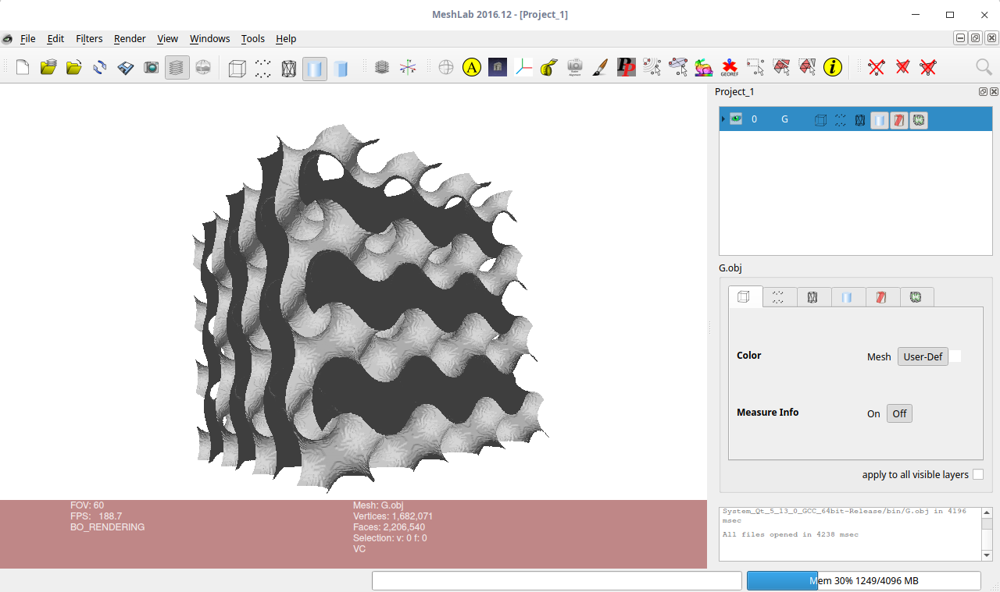

# Implicit Surface

This project is a test project about how to create a standard implicit surface (Triply Periodic Minimal Surfaces, TPMS) and how to convert it into a traditional triangle mesh. 

This project uses the basic marching box algorithm, which can easily convert an implicit surface into traingle mesh with low precision.

## Support Implicit Surface Types

This project create some type of Triply Periodic Minimal Surfaces, such as:

- P type
- D
- G
- I-WP
- F-RD
- L
- Tubular P
- Tubular G

# Image

The Image blew is a demo of G type implicit surface.

# Environment
1. Qt 5
2. glm library

# Reference
1. [Marching Cubes](http://paulbourke.net/geometry/polygonise/)
2. [Computer-aided porous scaffold design for tissue engineering using triply periodic minimal surfaces](https://link.springer.com/article/10.1007/s12541-011-0008-9)