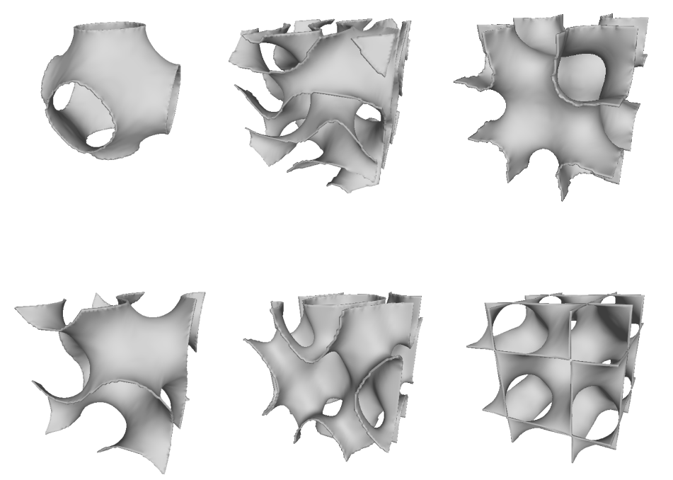
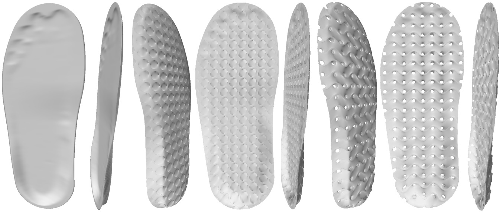

# LibTpms

This project is a test project about how to create a (Triply Periodic Minimal Surfaces, TPMS) porosus structure model and how to convert it into a traditional triangle mesh. 

This project uses the **basic marching box algorithm**, which can easily convert an implicit surface into traingle mesh with low precision.

This project can alse convert some fixed triangle mesh into TPMS porosus structure, will show below.

**Welcome stars!**

## Support Implicit Surface Types

This project create some type of Triply Periodic Minimal Surfaces, such as:

- P type
- D
- G
- I-WP
- F-RD
- L
- Tubular P
- Tubular G

# Example
Just some simple codes could generate TPMS shell model.

```cpp
    BoxTpmsSingeSurfaceAlgorithm boxTpmsSingeSurfaceAlgorithm;
    boxTpmsSingeSurfaceAlgorithm.setConfig(boxTpmsSingleSurfaceConfig);
    Mesh mesh = boxTpmsSingeSurfaceAlgorithm.process();

    MeshSmoothTool smoothTool;
    smoothTool.basicSmooth(mesh, 10);

    MeshShellTool meshShellTool;
    meshShellTool.shell(mesh, 0.03);

    Exporter expoter;
    expoter.writeOBJ(savePath, mesh);
```

You can create many different type of TMPS porous structure using the code like the example upon.
Some result of the code is screensnap at here.



The below is to use a insole model to create a TPMS porosus model.




# Dependency
1. greater than Qt 5
2. ~~glm library~~ *Will be replaced by Eigen3*
3. [Starlab](https://github.com/OpenGP/starlab)
4. openmesh 8.0
5. Eigen 3
6. opencv *Will be included*
7. Assimp

# Reference
1. [Marching Cubes](http://paulbourke.net/geometry/polygonise/)
2. [Computer-aided porous scaffold design for tissue engineering using triply periodic minimal surfaces](https://link.springer.com/article/10.1007/s12541-011-0008-9)